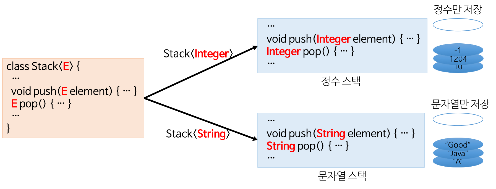

# 2. Java - Part2
### :book: Contents
* [OOP의 4가지 특징](#OOP의-4가지-특징)
* [OOP의 5대 원칙 (SOLID)](#OOP의-5대-원칙)
* [객체지향 프로그래밍과 절차지향 프로그래밍의 차이](#객체지향-프로그래밍과-절차지향-프로그래밍의-차이)
* [객체지향(Object-Oriented)이란](#객체지향(Object-Oriented)이란)
* [java의 non-static 멤버와 static 멤버의 차이](#java의-non-static-멤버와-static-멤버의-차이)
  * [Q. java의 main 메서드가 static인 이유](#java의-main-메서드가-static인-이유)
* [java의 final 키워드 (final/finally/finalize)](#java의-final-키워드)
* [java의 제네릭(Generic)과 c++의 템플릿(Template)의 차이](#java의-제네릭과-c++의-템플릿의-차이)

---

### OOP의 4가지 특징
1. 추상화(Abstraction)
    * 구체적인 사물들의 공통적인 특징을 파악해서 이를 하나의 개념(집합)으로 다루는 것
    * 각 객체의 구체적인 개념에 의존하지 말고 추상적 개념에 의존해야 설계를 유연하게 변경할 수 있다.
    * 
2. 캡슐화(Encapsulation)
    * **참고** SW 공학에서 요구사항 변경에 대처하는 고전적인 설계 원리
    * 높은 응집도와 낮은 결합도를 유지할 수 있도록 설계해야 요구사항을 변경할 때 유연하게 대처할 수 있다.
      1. 응집도(Cohesion)
         * 클래스나 모듈 안의 요소들이 얼마나 밀접하게 관련되어 있는지를 나타낸다.
      2. 결합도(Coupling)
         * 어떤 기능을 실행하는 데 다른 클래스나 모듈들에 얼마나 의존적인지를 나타낸다. 
    * 캡슐화는 **정보 은닉**을 통해 **높은 응집도와 낮은 결합도**를 갖도록 한다.
      * 정보 은닉(information hiding)
        * 필요가 없는 정보는 외부에서 접근하지 못하도록 제한하는 것
        * private 키워드
      * 정보 은닉이 왜 필요할까?
        * SW는 결합이 많을수록 문제가 많이 발생한다.
        * 한 클래스가 변경이 발생하면 변경된 클래스의 비밀에 의존하는 다른 클래스들도 변경해야 할 가능성이 커진다는 뜻이다. 
3. 상속(Inheritance)
    * 기존의 클래스를 재사용하여 새로운 클래스를 작성하는 것이다.
    * 보다 적은 코드로 새로운 클래스를 작성할 수 있고, 코드를 공통적으로 관리할 수 있기 대문에 코드의 추가 및 변경이 매우 용이하다.
    * 이러한 특징은 코드의 재사용성을 높이고 코드의 중복을 제거하여 프로그램의 생산성과 유지보수에 크게 기여한다.
4. 다형성(Polymorphism)
    * 서로 다른 클래스의 객체가 같은 메시지를 받았을 때 각자의 방식으로 동작하는 능력
    * 같은 이름의 메소드를 여러개 정의(오버로딩)
    * **오버로딩**의 장점 : 하나의 이름을 정의함으로써 하나의 이름만 기억하면 되므로 기억하기도 쉽고 같은 기능을 한다는 것을 쉽게 예측할 수 있다.
> [https://gmlwjd9405.github.io/2018/07/05/oop-features.html](https://gmlwjd9405.github.io/2018/07/05/oop-features.html)

### OOP의 5대 원칙
"**SOLID**" 원칙
* **S**: 단일 책임 원칙(SRP, Single Responsibility Principle)
  * 객체는 단 하나의 책임만 가져야 한다.
* **O**: 개방-폐쇄 원칙(OCP, Open Closed Principle)
  * 기존의 코드를 변경하지 않으면서 기능을 추가할 수 있도록 설계가 되어야 한다.
* **L**: 리스코프 치환 원칙(LSP, Liskov Substitution Principle)
  * 일반화 관계에 대한 이야기며, 자식 클래스는 최소한 자신의 부모 클래스에서 가능한 행위는 수행할 수 있어야 한다.
* **I**: 인터페이스 분리 원칙(ISP, Interface Segregation Principle)
  * 인터페이스를 클라이언트에 특화되도록 분리시키라는 설계 원칙이다.
* **D**: 의존 역전 원칙(DIP, Dependency Inversion Principle)
  * 의존 관계를 맺을 때 변화하기 쉬운 것 또는 자주 변화하는 것보다는 변화하기 어려운 것, 거의 변화가 없는 것에 의존하라는 것이다.
> [https://gmlwjd9405.github.io/2018/07/05/oop-solid.html](https://gmlwjd9405.github.io/2018/07/05/oop-solid.html)

### 객체지향-프로그래밍과-절차지향-프로그래밍의-차이
- **절차지향(Procedural Programming)이란?**
    * **개념** : 물이 위에서 아래로 흐르는 것처럼 순차적인 처리가 중요시 되며 프로그램 전체가 유기적으로 연결되도록 만드는 프로그래밍 기법
    * **대표적인 절차지향 언어** : C언어
    * 컴퓨터의 작업 처리 방식과 유사하기 때문에 객체 지향 언어를 사용하는 것에 비해 더 빨리 처리되어 **시간적으로 유리**하다.
    * **장점**
        * 컴퓨터의 처리 구조와 유사해 실행 속도가 빠름
    * **단점**
        * 유지 보수가 어렵다
        * 실행 순서가 정해져 있으므로 코드의 순서가 바뀌면 동일한 결과를 보장하기 어렵다
        * 디버깅이 어렵다.
 
* **객체지향 언어가 등장하게 되는 계기**
    * 옛날엔 H/W와 S/W의 개발 속도차이가 크지 않았지만, S/W언어의 발달과 컴파일러의 발달로 **H/W가 S/W의 발달을 처리하지 못하는 상황이 발생**
    * 객체지향 프로그래밍은 개발하려는 것을 **기능별로 묶어 모듈화**를 함으로써 H/W가 같은 기능을 중복으로 연산하지 않도록 하고 모듈을 재활용하기 때문에 **H/W의 처리양을 획기적으로 줄여줌**
   
* **객체지향(Object Oriented Programming)이란?**
    * **객체지향의 정의** : 실제 세게를 모델링하여 S/W를 개발하는 방법
    * **데이터와 절차를 하나의 덩어리로 묶어서 생각하는 기법**으로 마치 컴퓨터 부품을 하나씩 사다가 컴퓨터를 조립하는 것과 같은 방법
    * **객체 지향의 3대 특성** : 캡슐화, 상속, 다형성
    * **장점**
        1. 신뢰성 있는 소프트웨어를 쉽게 작성할 수 있다. (개발자가 만든 데이터를 사용하기에 신뢰할 수 있다.)
        2. 코드를 재사용하기 쉽다. (코드의 재활용성이 높다)
        3. 업그레이드가 쉽다.
        4. 디버깅이 쉽다.
    * **단점**
        1. 처리속도가 절차지향보다 느리다.
        2. 설계에 많은 시간 소요가 들어간다.

* **객체지향과 절차지향의 차이점** 
    * 절차지향 : 순차적인 실행에 초점 (데이터를 중심으로 함수를 구현)
    * 객체지향 : 객체 간의 관계/조직에 초점을 두고 있다. (기능을 중심으로 메소드를 구현)
    * But. 객체지향의 반대는 절차지향이 아니고 절차지향의 반대는 객체지향이 아니다.

> :arrow_double_up:[Top](#7-java)    :leftwards_arrow_with_hook:[Back](https://github.com/jihyuno301/tech-interview/blob/master/README.md)    :information_source:[Home](https://github.com/jihyuno301/tech-interview)
> - [절자치향 VS 객체지향 :: 개인적인공간](https://brownbears.tistory.com/407)

### 객체지향(Object-Oriented)이란

- **객체 지향 프로그래밍(OOP)이란?**
    - 개념 : 컴퓨터 프로그래밍 패러다임 중 하나로, 프로그래밍에서 필요한 데이터를 추상화시켜 상태와 행위를 가진 객체를 만들고 그 객체들 간의 유기적인 상호작용을 통해 로직을 구성하는 프로그래밍 방법
    - 이 때, 객체는 목적을 달성하기 위해 협력하는 존재로 자신만의 상태를 가지고 협력 여부를 판단하고 협력할 때는 객체의 방식대로 처리   
    협력의 과정에서 역할을 부여받고 그 역할에 따라 행동하는 존재
    
> - **프로그래밍 패러다임**   
프로그래밍의 원칙, 어떤 것을 기준으로 세워두고 프로그래밍 하는 것을 말한다.
> - **객체**   
프로그래밍 기능 구성을 위해 존재하는 것 그리고 다른 객체와 구별되는 것
> - 즉, 어떤 기능을 만듦에 있어서 1단계 무엇 2단계 무엇 이렇게 프로그래밍을 하는 것이 아니라 그러한 기능을 만듦에 있어서 객체들의 협력 관점으로 만들겠다는 것   
(어떤 객체는 이 일을 하고, 어떤 객체는 저 일을 하고 분업화 하겠다는 것)
 
- **객체 지향 프로그래밍의 장.단점**
    - **장점**
        1. 코드 재사용이 용이
            * 남이 만든 클래스를 가져와서 이용할 수 있고 상속을 통해 확장해서 사용할 수 있다.
        2. 유지 보수가 쉽다.
            * 절차 지향 프로그래밍에서는 코드를 수정해야 할 때 일일이 찾아 수정해야하는 반면 객체 지향 프로그래밍에서는 수정해야 할 부분이 클래스 내부에 멤버 변수 혹은 메소드로 있기 때문에 해당 부분만 수정하면 된다.
        3. 대형 프로젝트에 적합하다.
            * 클래스 단위로 모듈화시켜서 개발할 수 있으므로 대형 프로젝트처럼 여러명, 여러 회사에서 개발이 필요할 시 업무 분담이 쉽다.
    * **단점**
        1. 처리 속도가 상대적으로 느리다.
        2. 객체가 많으면 용량이 커질 수 있다.
        3. 설계시 많은 시간과 노력이 필요하다.
        
> :arrow_double_up:[Top](#7-java)    :leftwards_arrow_with_hook:[Back](https://github.com/jihyuno301/tech-interview/blob/master/README.md)    :information_source:[Home](https://github.com/jihyuno301/tech-interview)
> - [객체 지향 프로그래밍이 뭔가요? (꼬리에 꼬리를 무는 질문 1순위, 그놈의 OOP)](https://jeong-pro.tistory.com/95)
> - [[Java] 개념은 제대로 알고가자 - 객체지향 무엇인가](https://jinbroing.tistory.com/207)

### java의-non-static-멤버와-static-멤버의-차이
* non-static 멤버
    1. 공간적 특성
        - 멤버는 객체마다 별도 존재
        - 인스턴스 멤버라고 부름
    2. 시간적 특성
        - 객체 생성시에 멤버 생성됨
        - 객체가 생길 때 멤버도 생성
        - 객체 생성 후 멤버 사용 가능
        - 객체가 사라지면 멤버도 사라짐
    3. 공유의 특성
        - 공유되지 않음
        - 멤버는 객체 내에 각각 공간 유지
* static 멤버
    1. 공간적 특성
        - 멤버는 클래스 당 하나 생성
        - 멤버는 객체 내부가 아닌 별도의 공간(클래스 코드가 적재되는 메모리)에 생성
        - 클래스 멤버라고 부름
    2. 시간적 특성
        - 클래스 로딩 시에 멤버 생성
        - 객체가 생기기 전에 이미 생성
        - 객체가 생기기 전에도 사용 가능
        - 객체가 사라져도 멤버는 사라지지 않음
        - 멤버는 프로그램이 종료될 때 사라짐
    3. 공유의 특성
        - 동일한 클래스의 모든 객체들에 의해 공유됨
        
* static의 활용
    - 전역 변수와 전역 함수를 만들 때 사용
        - 자바에서는 C++과 달리 어떤 변수나 함수도 클래스 바깥에 존재할 수 없으며 클래스 멤버로 존재해야함   
            => 자바의 캡슐화 특징 때문에
        - static은 모든 클래스에서 공유하는 전역 변수나 모든 클래스에서 호출할 수 있는 전역 함수가 필요한 경우가 있음
            => static으로 활용
    - 공유 멤버를 만들고자 할 때 사용
        - static으로 선언된 필드나 메소드는 하나만 생성되어 클래스의 객체들 사이에서 공유됨

* static 메소드의 제약 조건
    - static 메소드는 static 멤버만 접근할 수 있다.
        - 객체 없이 존재하기 때문에 non-static 멤버를 사용할 수 없고 static 멤버만 사용 가능   
            반면 non-static 메소드는 static 멤버들을 사용할 수 있다.
    - static 메소드는 this를 사용할 수 없다.
        - static 메소드는 객체 없이도 존재하기 때문에 this를 사용할 수 없다.
        
> :arrow_double_up:[Top](#7-java)    :leftwards_arrow_with_hook:[Back](https://github.com/jihyuno301/tech-interview/blob/master/README.md)    :information_source:[Home](https://github.com/jihyuno301/tech-interview)
> - [[JAVA] static 멤버, static 메소드](https://transferhwang.tistory.com/146)

### java의 main 메서드가 static인 이유
- **static 키워드의 의미**
    - static은 java 프로그램이 실행되기 전에 static 함수나 static 변수를 첫 단계로 메모리에 올려 프로그램을 실행시킨다.   
    (static은 실행시 1순위) 또한, 프로그램이 종료될 때 까지 사라지지 않는다.
    
- **main에 static을 사용하는 이유?**
    - main 함수가 실행되기 위해서는 메모리에 미리 올라가야 한다.
    - 메모리에 올라가 있지 않으면, 시작점인 main() 메소드를 호출하려고 하는데 메모리에는 main이 없기 때문에 실행이 불가능
    - main 메소드도 호출되기 전에는 메모리에 올라가지 않는다. 때문에 main을 호출하기 위해서는 메모리에 main 메소드 내용이 있어야 하는데   
    이 main 메소드는 누군가 호출하기 전에 미리 메모리에 있어야 하기 때문에 static을 붙이는 것이다.
    - 그렇게함으로써 프로그램의 시작점으로 main이 실행되는 것이다.
        
> :arrow_double_up:[Top](#7-java)    :leftwards_arrow_with_hook:[Back](https://github.com/jihyuno301/tech-interview/blob/master/README.md)    :information_source:[Home](https://github.com/jihyuno301/tech-interview)
> - [main에 static 사용하는 이유 :: pu.. : 네이버블로그](https://blog.naver.com/blogpyh/220041002621)

### java의 final 키워드
* **final 키워드**
  * 개념: 변수나 메서드 또는 클래스가 '변경 불가능'하도록 만든다.
  * 원시(Primitive) 변수에 적용 시
    * 해당 변수의 값은 변경이 불가능하다.
  * 참조(Reference) 변수에 적용 시
    * 참조 변수가 힙(heap) 내의 다른 객체를 가리키도록 변경할 수 없다.
  * 메서드에 적용 시
    * 해당 메서드를 오버라이드할 수 없다.
  * 클래스에 적용 시
    * 해당 클래스의 하위 클래스를 정의할 수 없다.
* **finally 키워드**
  * 개념: try/catch 블록이 종료될 때 항상 실행될 코드 블록을 정의하기 위해 사용한다.
  * finally는 선택적으로 try 혹은 catch 블록 뒤에 정의할 때 사용한다.
  * finally 블록은 예외가 발생하더라도 항상 실행된다.
    * 단, JVM이 try 블록 실행 중에 종료되는 경우는 제외한다.
  * finally 블록은 종종 뒷마무리 코드를 작성하는 데 사용된다.
  * finally 블록은 try와 catch 블록 다음과, 통제권이 이전으로 다시 돌아가기 전 사이에 실행된다.
* **finalize() 메서드**
  * 개념: 쓰레기 수집기(GC, Garbage Collector)가 더 이상의 참조가 존재하지 않는 객체를 메모리에서 삭제하겠다고 결정하는 순간 호출된다.
  * Object 클래스의 finalize() 메서드를 오버라이드해서 맞춤별 GC를 정의할 수 있다.
    * `protected void finalize() throws Throwable { // 파일 닫기, 자원 반환 등등 }`

> :arrow_double_up:[Top](#7-java)    :leftwards_arrow_with_hook:[Back](https://github.com/jihyuno301/tech-interview/blob/master/README.md)    :information_source:[Home](https://github.com/jihyuno301/tech-interview)
> - [https://gmlwjd9405.github.io/2018/08/06/java-final.html](https://gmlwjd9405.github.io/2018/08/06/java-final.html)

### java의 제네릭과 c++의 템플릿의 차이
* java의 제네릭(Generic)
  * 개념: 모든 종류의 타입을 다룰 수 있도록 일반화된 타입 매개 변수(generic type)로 클래스나 메서드를 선언하는 기법
  * 
  * 처리 방법: 타입 제거(type erasure)라는 개념에 근거한다.
    * 소스 코드를 JVM이 인식하는 바이트 코드로 변환할 때 인자로 주어진 타입을 제거하는 기술이다.
    * 제네릭이 있다고 해서 크게 달라지는 것은 없다. 단지 코드를 좀 더 예쁘게 할 뿐이다.
    * 그래서 java의 제네릭(Generic)은 때로는 **문법적 양념(syntactic sugar)** 이라고 부른다.
~~~java
Vector<String> vector = new Vector<String>();
vector.add(new String("hello"));
String str = vector.get(0);

// 컴파일러가 아래와 같이 변환
Vector vector = new Vector();
vector.add(new String("hello"));
String str = (String) vector.get(0);
~~~
* c++의 템플릿(Template)
  * 개념: 템플릿은 하나의 클래스를 서로 다른 여러 타입에 재사용할 수 있도록 하는 방법
    * 예를 들어 여러 타입의 객체를 저장할 수 있는 연결리스트와 같은 자료구조를 만들 수 있다.
  * 처리 방법: 컴파일러는 인자로 주어진 각각의 타입에 대해 별도의 템플릿 코드를 생성한다.
    * 예를 들어 MyClass<Foo>가 MyClass<Bar>와 정적 변수(static variable)를 공유하지 않는다.
    * 하지만 java에서 정적 변수는 제네릭(Generic) 인자로 어떤 타입을 주었는지에 관계없이 MyClass로 만든 모든 객체가 공유한다.
    * 즉, 템플릿은 좀 더 **우아한 형태의 매크로** 다.
~~~c
/** MyClass.h **/
template<class T> class MyClass {
  public:
    static int val;
    MyClass(int v) { val = v; }
};

/** MyClass.cpp **/
template<typename T>
int MyClass<T>::bar;
template class MyClass<Foo>;
template class MyClass<Bar>;

/** main.cpp **/
MyClass<Foo> * foo1 = new MyClass<Foo>(10);
MyClass<Foo> * foo2 = new MyClass<Foo>(15);
MyClass<Bar> * bar1 = new MyClass<Bar>(20);
MyClass<Bar> * bar2 = new MyClass<Bar>(35);
int f1 = foo1->val; // 15
int f2 = foo2->val; // 15
int b1 = bar1->val; // 35
int b2 = bar2->val; // 35
~~~

* java의 제네릭과 c++의 템플릿의 차이
  1. List<String>처럼 코드를 작성할 수 있다는 이유에서 동등한 개념으로 착각하기 쉽지만 두 언어가 이를 처리하는 방법은 아주 많이 다르다.
  2. c++의 Template에는 int와 같은 기본 타입을 인자로 넘길 수 있지만, java의 Generic에서는 Integer을 대신 사용해야 한다.
  3. c++의 Template은 인자로 주어진 타입으로부터 객체를 만들어 낼 수 있지만, java에서는 불가능하다.
  4. java에서 MyClass로 만든 모든 객체는 Generic 타입 인자가 무엇이냐에 관계없이 전부 동등한 타입이다.(실행 시간에 타입 인자 정보는 삭제된다.)
      * c++에서는 다른 Template 타입 인자를 사용해 만든 객체는 서로 다른 타입의 객체이다.
  5. java의 경우 Generic 타입 인자를 특정한 타입이 되도록 제한할 수 있다.
      * 예를 들어 CardDeck을 Generic 클래스로 정의할 때 CardGame의 하위 클래스만 사용되도록 제한할 수 있다.
  6. java에서 Generic 타입의 인자는 정적 메서드나 변수를 선언하는 데 사용될 수 없다.
      * 왜냐하면 MyClass<Foo>나 MyClass<Bar>가 이 메서드와 변수를 공유하기 때문이다.
      * c++ Template은 이 두 클래스를 다른 클래스로 처리하므로 Template 타입 인자를 정적 메서드나 변수를 선언하는 데 사용할 수 있다.

> :arrow_double_up:[Top](#7-java)    :leftwards_arrow_with_hook:[Back](https://github.com/jihyuno301/tech-interview/blob/master/README.md)    :information_source:[Home](https://github.com/jihyuno301/tech-interview)
> - [코딩 인터뷰 완전 분석, 프로그래밍인사이트](https://www.kyobobook.co.kr/product/detailViewKor.laf?mallGb=KOR&ejkGb=KOR&barcode=9788966263080&OV_REFFER=http://click.linkprice.com/click.php?m=kbbook&a=A100532541&l=9999&l_cd1=0&u_id=jm0gctc7ca029ofs02yqe&l_cd2=0&tu=https%3A%2F%2Fwww.kyobobook.co.kr%2Fproduct%2FdetailViewKor.laf%3FmallGb%3DKOR%26ejkGb%3DKOR%26barcode%3D9788966263080)
