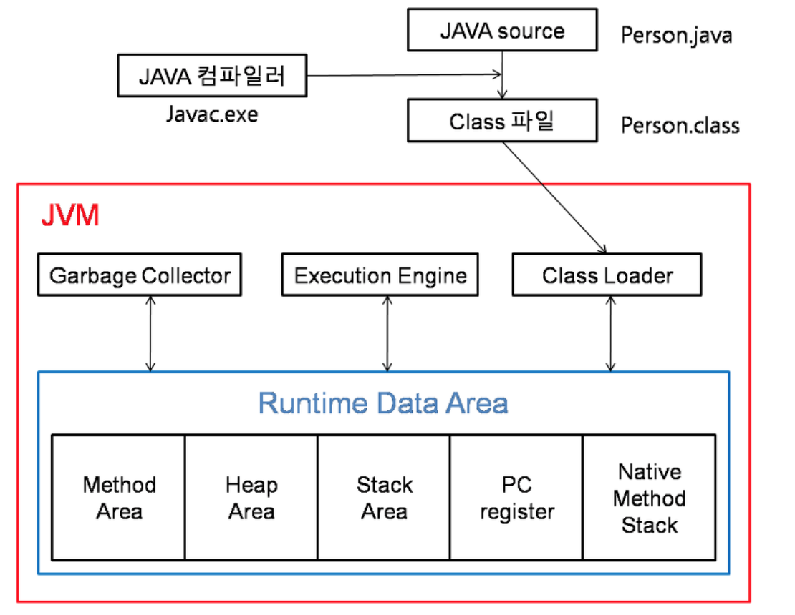

# 7. Java
**:book: Contents**
* [JVM 구조](#jvm-구조)
* [Java Collections Framework](#java-collections-framework)
  * [java Map 인터페이스 구현체의 종류](#java-map-인터페이스-구현체의-종류)
  * [java Set 인터페이스 구현체의 종류](#java-set-인터페이스-구현체의-종류)
  * [java List 인터페이스 구현체의 종류](#java-list-인터페이스-구현체의-종류)
* [Annotation](#annotation)
* [String, StringBuilder, StringBuffer](#string-stringbuilder-stringbuffer)
* [동기화와 비동기화의 차이(Syncronous vs Asyncronous)](#동기화와-비동기화의-차이)
* [java에서 '=='와 'equals()'의 차이](#java에서-==와-equals()의-차이)
* [java의 리플렉션(Reflection) 이란](#java의-리플렉션-이란)

---

### JVM 구조

- JVM(Java Virtual Machine)
   - 자바 가상 머신으로 자바 바이트 코드를 실행할 수 있는 주체다.
   - CPU나 운영체제(플랫폼)의 종류와 무관하게 실행이 가능하다.
   - 즉, 운영체제 위에서 동작하는 프로세스로 자바 코드를 컴파일해서 얻은 바이트 코드를 해당 운영체제가 이해할 수 있는 기계어로 바꿔 실행시켜주는 역할을 한다.
   - JVM의 구성을 살펴보면 크게 4가지(Class Loader, Execution Engine, Garbage Collector, Runtime Data Area)로 나뉜다.

1. Class Loader
    - 자바에서 소스를 작성하면 Person.java 처럼 .java파일이 생성된다.
    - .java 소스를 자바컴파일러가 컴파일하면 Person.class 같은 .class파일(바이트코드)이 생성된다.
    - 이렇게 생성된 클래스파일들을 엮어서 JVM이 운영체제로부터 할당받은 메모리영역인 Runtime Data Area로 적재하는 역할을 Class Loader가 한다. (자바 애플리케이션이 실행중일 때 이런 작업이 수행된다.)
  
2. Execution Engine
    - Class Loader에 의해 메모리에 적재된 클래스(바이트 코드)들을 기계어로 변경해 명령어 단위로 실행하는 역할을 한다.
    - 명령어를 하나 하나 실행하는 인터프리터(Interpreter)방식이 있고 JIT(Just-In-Time) 컴파일러를 이용하는 방식이 있다.
    - JIT 컴파일러는 적절한 시간에 전체 바이트 코드를 네이티브 코드로 변경해서 Execution Engine이 네이티브로 컴파일된 코드를 실행하는 것으로 성능을 높이는 방식이다.
  
3. Garbage Collector
    - Garbage Collector(GC)는 Heap 메모리 영역에 생성(적재)된 객체들 중에 참조되지 않는 객체들을 탐색 후 제거하는 역할을 한다.
    - GC가 역할을 하는 시간은 정확히 언제인지를 알 수 없다. (참조가 없어지자마자 해제되는 것을 보장하지 않음)
    - 또 다른 특징은 GC가 수행되는 동안 GC를 수행하는 쓰레드가 아닌 다른 모든 쓰레드가 일시정지된다.
    - 특히 Full GC가 일어나서 수 초간 모든 쓰레드가 정지한다면 장애로 이어지는 치명적인 문제가 생길 수 있는 것이다. (GC와 관련된 내용은 아래 Heap영역 메모리를 설명할 때 더 자세히 알아본다.)

4. Runtime Data Area
    - JVM의 메모리 영역으로 자바 애플리케이션을 실행할 때 사용되는 데이터들을 적재하는 영역이다.
    - 이 영역은 크게 Method Area, Heap Area, Stack Area, PC Register, Native Method Stack로 나눌 수 있다.

> :arrow_double_up:[Top](#7-java)    :leftwards_arrow_with_hook:[Back](https://github.com/jihyuno301/tech-interview/blob/master/README.md)    :information_source:[Home](https://github.com/jihyuno301/tech-interview)
> - [https://jeong-pro.tistory.com/148](https://jeong-pro.tistory.com/148)
> - [http://www.itworld.co.kr/news/110837](http://www.itworld.co.kr/news/110837)
> - [http://hoonmaro.tistory.com/19](http://hoonmaro.tistory.com/19)

---
### Java Collections Framework

* Map
    * 검색할 수 있는 인터페이스
    * 데이터를 삽입할 때 Key와 Value의 형태로 삽입되며, Key를 이용해서 Value를 얻을 수 있다.
* Collection
    * List
        * 순서가 있는 Collection
        * 데이터를 중복해서 포함할 수 있다.
    * Set
        * 집합적인 개념의 Collection
        * 순서의 의미가 없다.
        * 데이터를 중복해서 포함할 수 없다.
* Collections Framework 선택 과정
  1. Map과 Collection 인터페이스 중 선택
    1-1. Collection 선택 시 사용 목적에 따라 List와 Set중 선택
  2. 사용 목적에 따라 Map, List, Set 각각의 하위 구현체를 선택
    2-1. Map: HashMap, LinkedHashMap, HashTable, TreeMap
    2-2. List: LinkedList, ArrayList
    2-3. Set: TreeSet, HashSet
* Collections Framework 동기화
    * [https://madplay.github.io/post/java-collection-synchronize](https://madplay.github.io/post/java-collection-synchronize)

> :arrow_double_up:[Top](#7-java)    :leftwards_arrow_with_hook:[Back](https://github.com/jihyuno301/tech-interview/blob/master/README.md)    :information_source:[Home](https://github.com/jihyuno301/tech-interview)

---
### java Map 인터페이스 구현체의 종류
* HashMap
    * Entry<K,V>의 배열로 저장되며, 배열의 index는 내부 해쉬 함수를 통해 계산된다.
    * 내부 hash값에 따라서 키순서가 정해지므로 특정 규칙없이 출력된다.
    * key와 value에 null값을 허용한다.
    * 비동기 처리
    * 시간복잡도: O(1)
* LinkedHashMap
    * HaspMap을 상속받으며, Linked List로 저장된다.
    * 입력 순서대로 출력된다.
    * 비동기 처리
    * 시간복잡도: O(n)
* TreeMap
    * 내부적으로 레드-블랙 트리(Red-Black tree)로 저장된다.
    * 키값이 기본적으로 오름차순 정렬되어 출력된다.
    * 키값에 대한 Compartor 구현으로 정렬 방법을 지정할 수 있다.
    * 시간복잡도: O(logn)
* ConCurrentHashMap
    * multiple lock
    * update할 때만 동기 처리
    * key와 value에 null값을 허용하지 않는다.
* HashTable
    * single lock
    * 모든 메서드에 대해 동기 처리
    * key와 value에 null값을 허용하지 않는다.

> :arrow_double_up:[Top](#7-java)    :leftwards_arrow_with_hook:[Back](https://github.com/jihyuno301/tech-interview/blob/master/README.md)    :information_source:[Home](https://github.com/jihyuno301/tech-interview)

---
### java Set 인터페이스 구현체의 종류
* HashSet
  * 저장 순서를 유지하지 않는 데이터의 집합이다.
  * 해시 알고리즘(hash algorithm)을 사용하여 검색 속도가 매우 빠르다.
  * 내부적으로 HashMap 인스턴스를 이용하여 요소를 저장한다.
* LinkedHashSet
    * 저장 순서를 유지하는 HashSet
* TreeSet
    * 데이터가 정렬된 상태로 저장되는 이진 탐색 트리(binary search tree)의 형태로 요소를 저장한다.
    * 이진 탐색 트리 중에 성능을 향상시킨 레드-블랙 트리(Red-Black tree)로 구현되어 있다.
    * Compartor 구현으로 정렬 방법을 지정할 수 있다.

> :arrow_double_up:[Top](#7-java)    :leftwards_arrow_with_hook:[Back](https://github.com/jihyuno301/tech-interview/blob/master/README.md)    :information_source:[Home](https://github.com/jihyuno301/tech-interview)

---
### java List 인터페이스 구현체의 종류
* ArrayList
  * 단방향 포인터 구조로 각 데이터에 대한 인덱스를 가지고 있어 데이터 검색에 적합하다.
  * 데이터의 삽입, 삭제 시 해당 데이터 이후 모든 데이터가 복사되므로 삽입, 삭제가 빈번한 데이터에는 부적합하다.
* LinkedList
    * 양방향 포인터 구조로 데이터의 삽입, 삭제 시 해당 노드의 주소지만 바꾸면 되므로 삽입, 삭제가 빈번한 데이터에 적합하다.
    * 데이터의 검색 시 처음부터 노드를 순회하므로 검색에는 부적합하다.
    * 스택, 큐, 양방향 큐 등을 만들기 위한 용도로 쓰인다.
* Vector
    * 내부에서 자동으로 동기화 처리가 일어난다.
    * 성능이 좋지 않고 무거워 잘 쓰이지 않는다.

> :arrow_double_up:[Top](#7-java)    :leftwards_arrow_with_hook:[Back](https://github.com/jihyuno301/tech-interview/blob/master/README.md)    :information_source:[Home](https://github.com/jihyuno301/tech-interview)

---
### Annotation
> :arrow_double_up:[Top](#7-java)    :leftwards_arrow_with_hook:[Back](https://github.com/jihyuno301/tech-interview/blob/master/README.md)    :information_source:[Home](https://github.com/jihyuno301/tech-interview)

---
### String StringBuilder StringBuffer
* String
    * 새로운 값을 할당할 때마다 새로 클래스에 대한 객체가 생성된다.
    * String에서 저장되는 문자열은 private final char[]의 형태이기 때문에 String 값은 바꿀수 없다.
        * private: 외부에서 접근 불가
        * final: 초기값 변경 불가
    * String + String + String...
        * 각각의 String 주솟값이 Stack에 쌓이고, Garbage Collector가 호출되기 전까지 생성된 String 객체들은 Heap에 쌓이기 때문에 메모리 관리에 치명적이다.
    * String을 직접 더하는 것보다는 StringBuffer나 StringBuilder를 사용하는 것이 좋다.
* StringBuilder, StringBuffer
    * memory에 append하는 방식으로, 클래스에 대한 객체를 직접 생성하지 않는다.
    * StringBuilder
        * 변경가능한 문자열
        * 비동기 처리
    * StringBuffer
        * 변경가능한 문자열
        * 동기 처리
        * multiple thread 환경에서 안전한 클래스(thread safe)
* Java 버전별 String Class 변경 사항
    * JDK 1.5 버전 이전에서는 문자열 연산(+, concat)을 할 때 조합된 문자열을 새로운 메모리에 할당하여 참조해 성능상의 이슈 존재
    * JDK 1.5 버전 이후에는 컴파일 단계에서 String 객체를 StringBuilder로 컴파일 되도록 변경됨
    * 그래서 JDK 1.5 이후 버전에서는 String 클래스를 사용해도 StringBuilder와 성능 차이가 없어짐
    * 하지만 반복 루프를 사용해서 문자열을 더할 때에는 객체를 계속 새로운 메모리에 할당함
    * String 클래스를 사용하는 것 보다는 스레드와 관련이 있으면 StringBuffer, 스레드 안전 여부와 상관이 없으면 StringBuilder를 사용하는 것을 권장

> :arrow_double_up:[Top](#7-java)    :leftwards_arrow_with_hook:[Back](https://github.com/jihyuno301/tech-interview/blob/master/README.md)    :information_source:[Home](https://github.com/jihyuno301/tech-interview)
> - [https://12bme.tistory.com/42](https://12bme.tistory.com/42)

---
### 동기화와 비동기화의 차이
* 동기화(Syncronous)
* 비동기화(Asyncronous)

> :arrow_double_up:[Top](#7-java)    :leftwards_arrow_with_hook:[Back](https://github.com/jihyuno301/tech-interview/blob/master/README.md)    :information_source:[Home](https://github.com/jihyuno301/tech-interview)
> - 

---
### java에서 ==와 equals()의 차이
* "=="
  * 항등 **연산자(Operator)** 이다.
    * <-->  !=
  * **참조 비교(Reference Comparison)** ; (주소 비교, Address Comparison)
    * 두 객체가 같은 메모리 공간을 가리키는지 확인한다.
  * 반환 형태: boolean type
    * 같은 주소면 return true, 다른 주소면 return false
  * 모든 기본 유형(Primitive Types)에 대해 적용할 수 있다.
    * byte, short, char, int, float, double, boolean
* "equals()"
  * 객체 비교 **메서드(Method)** 이다.
  * <-->  !(s1.equals(s2));
  * **내용 비교(Content Comparison)**
    * 두 객체의 값이 같은지 확인한다.
    * 즉, 문자열의 데이터/내용을 기반으로 비교한다.
  * 기본 유형(Primitive Types)에 대해서는 적용할 수 없다.
  * 반환 형태: boolean type
    * 같은 내용이면 return true, 다른 내용이면 return false
* "==" VS "equals()" 예시

~~~java
public class Test {
    public static void main(String[] args) {
        // Thread 객체
        Thread t1 = new Thread();
        Thread t2 = new Thread(); // 새로운 객체 생성. 즉, s1과 다른 객체.
        Thread t3 = t1; // 같은 대상을 가리킨다.
        // String 객체
        String s1 = new String("WORLD");
        String s2 = new String("WORLD");
        /* --print-- */
        System.out.println(t1 == t3); // true
        System.out.println(t1 == t2); // false(서로 다른 객체이므로 별도의 주소를 갖는다.)
        System.out.println(t1.equals(t2)); // false
        System.out.println(s1.equals(s2)); // true(모두 "WORLD"라는 동일한 내용을 갖는다.)
    }
}
~~~

> :arrow_double_up:[Top](#7-java)    :leftwards_arrow_with_hook:[Back](https://github.com/jihyuno301/tech-interview/blob/master/README.md)    :information_source:[Home](https://github.com/jihyuno301/tech-interview)
> - [https://gmlwjd9405.github.io/2018/10/06/java-==-and-equals.html](https://gmlwjd9405.github.io/2018/10/06/java-==-and-equals.html)

---
### java의 리플렉션 이란
* 리플렉션(Reflection) 이란?
  * 자바에서 이미 로딩이 완료된 클래스에서 또 다른 클래스를 동적으로 로딩(Dynamic Loading)하여 생성자(Constructor), 멤버 필드(Member Variables) 그리고 멤버 메서드(Member Method) 등을 사용할 수 있는 기법이다.
  * 클래스의 패키지 정보, 접근 지정자, 수퍼 클래스, 어노테이션(Annotation) 등을 얻을 수 있다.
  * 컴파일 시간(Compile Time)이 아니라 실행 시간(Run Time)에 동적으로 특정 클래스의 정보를 객체화를 통해 분석 및 추출해낼 수 있는 프로그래밍 기법이다.
* 사용 방법
  * `Class.forName("클래스이름")`
  * 클래스의 이름으로부터 인스턴스를 생성할 수 있고, 이를 이용하여 클래스의 정보를 가져올 수 있다.
  ~~~java
  public class DoHee {
      public String name;
      public int number;
      public void setDoHee (String name, int number) {
        this.name = name;
        this.number = number;
      }
      public void setNumber(int number) {
          this.number = number;
      }
      public void sayHello(String name) {
        System.out.println("Hello, " + name);
    }
  }
  ~~~
  ~~~java
  import java.lang.reflect.Method;
  import java.lang.reflect.Field;

  public class ReflectionTest {
      public void reflectionTest() {
          try {
              Class myClass = Class.forName("DoHee");
              Method[] methods = myClass.getDeclaredMethods();

              /* 클래스 내 선언된 메서드의 목록 출력 */
              /* 출력 : public void DoHee.setDoHee(java.lang.String,int)
                       public void DoHee.setNumber(int)
                       public void DoHee.sayHello(java.lang.String) */
              for (Method method : methods) {
                  System.out.println(method.toString());
              }

              /* 메서드의 매개변수와 반환 타입 확인 */
              /* 출력 : Class Name : class DoHee
                       Method Name : setDoHee
                       Return Type : void */
              Method method = methods[0];
              System.out.println("Class Name : " + method.getDeclaringClass());
              System.out.println("Method Name : " + method.getName());
              System.out.println("Return Type : " + method.getReturnType());

              /* 출력 : Param Type : class java.lang.String
                       Param Type : int */
              Class[] paramTypes = method.getParameterTypes();
              for(Class paramType : paramTypes) {
                  System.out.println("Param Type : " + paramType);
              }

              /* 메서드 이름으로 호출 */
              Method sayHelloMethod = myClass.getMethod("sayHello", String.class);
              sayHelloMethod.invoke(myClass.newInstance(), new String("DoHee")); // 출력 : Hello, DoHee

              /* 다른 클래스의 멤버 필드의 값 수정 */
              Field field = myClass.getField("number");
              DoHee obj = (DoHee) myClass.newInstance();
              obj.setNumber(5);
              System.out.println("Before Number : " + field.get(obj)); // 출력 : Before Number : 5
              field.set(obj, 10);
              System.out.println("After Number : " + field.get(obj)); // 출력 : After Number : 10
          } catch (Exception e) {
              // Exception Handling
          }
      }

      public static void main(String[] args) {
          new ReflectionTest().reflectionTest();
      }
  }
  ~~~
* 왜 사용할까?
  * 실행 시간에 다른 클래스를 동적으로 로딩하여 접근할 때
  * 클래스와 멤버 필드 그리고 메서드 등에 관한 정보를 얻어야할 때
  * 리플렉션 없이도 완성도 높은 코드를 구현할 수 있지만 사용한다면 조금 더 유연한 코드를 만들 수 있다.
* 주의할 점
  * 외부에 공개되지 않는 private 멤버도 `Field.setAccessible()` 메서드를 true로 지정하면 접근과 조작이 가능하기 때문에 주의해야 한다.

> :arrow_double_up:[Top](#7-java)    :leftwards_arrow_with_hook:[Back](https://github.com/WeareSoft/tech-interview#7-java)    :information_source:[Home](https://github.com/WeareSoft/tech-interview#tech-interview)
> - [https://madplay.github.io/post/java-reflection](https://madplay.github.io/post/java-reflection)

---

## Reference
> - 

## :house: [Home](https://github.com/jihyuno301/tech-interview)
