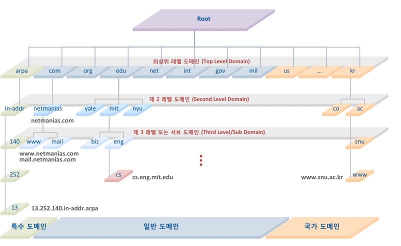
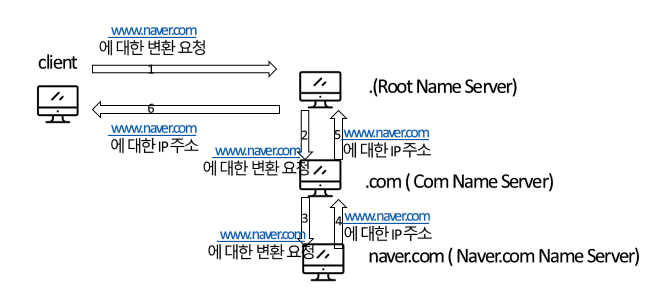
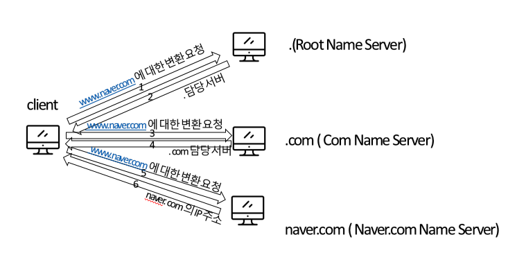

# 2. Network - Part3

 

### :book: Contents
- [DNS](#DNS란)
- [REST와 RESTful의 개념](#REST와 RESTful의 개념)
- [소켓(Socket)이란]
- [Socket.io와 WebSocket의 차이]
- [Frame, Packet, Segment, Datagram]

 

---

 

### DNS란?
</img>
- DNS의 등장 배경
	- TCP/IP 프로토콜을 사용하는 네트워크 안에서는 IP주소를 알고 있어야 상대방 장비와 연결이 가능하다.
	- 즉, 네트워크에서 도메인이나 호스트 이름을 숫자로 된 IP 주소로 해석해 주기 위해 TCP/IP Network Service인 DNS 등장
- DNS의 개념 (Domain Name System)
    - 숫자로 구성된 네트워크 주소인 IP주소를 사람이 이해하기 쉬운 명칭인 도메인 이름으로 상호 매칭시켜주는 시스템
    - 도메인에 해당하는 IP주소를 알려주거나 반대로 IP주소에 해당하는 도메인을 알려주는 서비스
	- UDP와 TCP **포트 53번**을 사용한다.
		- UDP : 일반적인 DNS 조회를 할 경우에 사용
		- TCP : Zone Transfer(영역 전송)와 512Byte를 초과하는 DNS 패킷을 전송해야 할 경우
	- 분산된 DB를 이용해 각 조직들은 자신들의 도메인 정보를 관리하는 DNS 서버를 자체적으로 운영
	- 이 수 많은 도메인의 **DNS 서버들이 상호 연동되어 있는 Domain Name Space를 구성**하게 된다.
- DNS의 구성 요소 
    
	1. 도메인 네임 스페이스 (Domain Name Space) : DNS가 저장, 관리하는 계층적 구조
		- 최상위에 루트 DNS 서버가 존재하고, 그 하위로 인터넷에 연결된 모든 노드가 연속해서 이어진 계층 구조로 구성
		- 각 레벨의 도메인은 그 하위 도메인에 관한 정보를 관리하는 구조 (계층적 구조)
		- 도메인(Domain) : 도메인 네임 스페이스의 서브 트리
	2. 네임 서버 (Name Sever) : 도메인 네임 스페이스의 트리 구조에 대한 정보를 가지고 있는 서버
		- 네임 서비스 : 도메인 이름을 IP 주소로 변환하는 것
		- 리졸버로부터 요청 받은 도메인 이름에 대한 IP주소를 다시 리졸버로 전달해주는 역할을 수행
		- 해당 도메인을 관리하는 주 네임 서버인 Primary Name Server와 보조 Secondary Name Server로 구성
	3. 리졸버 (Resolver) : client의 요청을 네임 서버로 전달하고 네임 서버로부터 정보를 받아 client에게 제공하는 기능 수행
	4. 스티브 리졸버(Stub Resolver) : 질의를 네임 서버로 전달하고 응답을 웹 브라우저로 전달하는 인터페이스 기능만을 수행
- DNS의 질의/응답 과정
  1. 재귀적 질의 (Recursive Queries)
    - **가장 간단한 유형의 DNS 쿼리**로, Client가 원하는 정보를 전달해 주거나, 정보가 없다면 에러 메시지를 전달
    - www.naver.com에 대한 변환 요청 과정
    
  2. 반복적 질의 (Iterative Queries)
    - 질의를 요청한 client 또는 server가 최종적인 응답을 받을 때까지 요청과 응답을 반복적으로 진행
    - 질의를 날릴 때 마다 서버는 질의에 응답이 가능한 NS 목록으로 응답한다.
    - www.naver.com에 대한 변환 요청 과정
    
- DNS의 역할
  1. 호스트 에일리어싱(Host Aliasing) : 복잡한 호스트 네임을 가진 호스트는 하나 이상의 별명을 가질 수 있다.
    - ex) www.naver.com == naver.com 따라서 정식 호스트 네임을 얻기 위해 사용한다.
  2. 메일 서버 에일리어싱(Mail Server Aliasing) : 위와 마찬가지로 메일주소의 별명을 가질 수 있고 DNS는 정식 호스트 네임을 알려주는 역할
  3. 도메인 네임을 IP주소로 변환해주는 역할을 한다.
  
> - [https://security-nanglam.tistory.com/24?category=800892](https://security-nanglam.tistory.com/24?category=800892)
> - [https://peemangit.tistory.com/52](https://peemangit.tistory.com/52)

 

### REST와 RESTful의 개념

- REST의 개념
