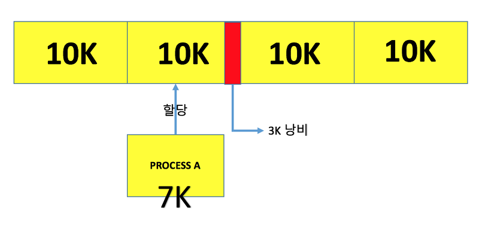
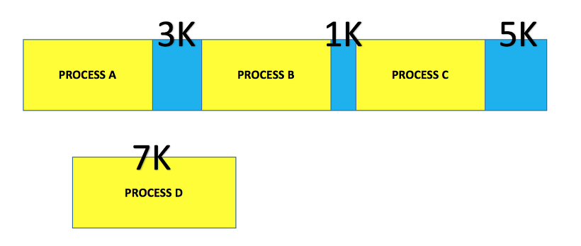
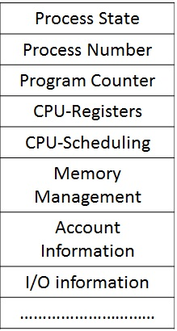

# 3. Operating System
**:book: Contents**
* [교착상태(데드락, Deadlock)의 개념과 조건](#교착상태의-개념과-조건)
* [사용자 수준 스레드와 커널 수준 스레드](#사용자-수준-스레드,-커널-수준-스레드)
* [외부 단편화와 내부 단편화](#외부-단편화와-내부-단편화)
* [Context Switching](#context-switching)
* [Swapping](#swapping)

### 교착상태의 개념과 조건
* 교착상태(데드락, Deadlock) 란
  * 첫 번째 스레드는 두 번째 스레드가 들고 있는 객체의 락이 풀리기를 기다리고 있고, 두 번째 스레드 역시 첫 번째 스레드가 들고 있는 객체의 락이 풀리기를 기다리는 상황을 일컷는다.
  * 모든 스레드가 락이 풀리기를 기다리고 있기 때문에, 무한 대기 상태에 빠지게 된다. 이런 스레드를 교착상태에 빠졌다고 한다.
* 교착상태의 4가지 조건
  1. 상호 배제(mutual exclusion)
      * 한 번에 한 프로세스만 공유 자원을 사용할 수 있다.
      * 좀 더 정확하게는, 공유 자원에 대한 접근 권한이 제한된다. 자원의 양이 제한되어 있더라도 교착상태는 발생할 수 있다.
  2. 들고 기다리기(hold and wait) = **점유대기**
      * 공유 자원에 대한 접근 권한을 갖고 있는 프로세스가, 그 접근 권한을 양보하지 않은 상태에서 다른 자원에 대한 접근 권한을 요구할 수 있다.
  3. 선취(preemption) 불가능 = **비선점**
      * 한 프로세스가 다른 프로세스의 자원 접근 권한을 강제로 취소할 수 없다.
  4. 대기 상태의 사이클(circular wait) = **순환대기**
      * 두 개 이상의 프로세스가 자원 접근을 기다리는데, 그 관계에 사이클이 존재한다.
* 교착상태 방지
  * 4가지 조건들 가운데 하나를 제거하면 된다.
  * 상호 배제(Mutual Exclusion)부정 : 한번에 여러개의 프로세스가 공유 자원을 사용할 수 있도록 한다.
  * 점유 및 대기(Hold and Wait) 부정 : 프로세스가 실행되기 전 필요한 모든 자원을 할당하여 프로세스 대기를 없애거나 자원이 점유되지 않은 상태에서만 자원을 요구하도록 한다.
  * 비선점(Non-preemption)부정 : 자원을 점유하고 있는 프로세스가 다른 자원을 요구할 때 점유하고 있는 자원을 반납하고, 요구한 자원을 사용하기 위해 기다리게 한다.
  * 환형 대기(Circular Wait)부정 : 자원을 선형 순서로 분류하여 고유 번호를 할당하고, 각 프로세스는 현재 점유한 자원의 고유 번호보다 앞이나 뒤 어느 한쪽 방향으로만 자원을 요구하도록 한다.

> :arrow_double_up:[Top](#3-operating-system)    :leftwards_arrow_with_hook:[Back](https://github.com/jihyuno301/tech-interview/blob/master/README.md)    :information_source:[Home](https://github.com/jihyuno301/tech-interview)
> - [코딩 인터뷰 완전 분석, 프로그래밍인사이트](https://www.kyobobook.co.kr/product/detailViewKor.laf?mallGb=KOR&ejkGb=KOR&barcode=9788966263080&OV_REFFER=http://click.linkprice.com/click.php?m=kbbook&a=A100532541&l=9999&l_cd1=0&u_id=jm0gctc7ca029ofs02yqe&l_cd2=0&tu=https%3A%2F%2Fwww.kyobobook.co.kr%2Fproduct%2FdetailViewKor.laf%3FmallGb%3DKOR%26ejkGb%3DKOR%26barcode%3D9788966263080)
> - [https://coding-factory.tistory.com/311](https://coding-factory.tistory.com/311)

### 사용자 수준 스레드와 커널 수준 스레드

* 쓰레드(Thread)
  * 쓰레드(Thread)란 간단히 말해 프로세스 내에서 실행되는 실행 단위이다. 
  * 프로세스는 이러한 쓰레드를 한 개 이상으로 나눌 수 있다. 
  * 쓰레드는 프로그램 카운터와 스택 포인터 등을 비롯한 쓰레드 실행 환경 정보(Context 정보), 지역 데이터, 스택을 독립적으로 가지면서 코드, 전역 데이터, 힙을 다른 쓰레드와 공유한다.

* 쓰레드의 구현
  * 쓰레드는 운영체제에 따라 다양하게 구현할 수 있는데, 대부분 다음 세 가지 형태로 구현한다. 
  * 사용자 수준 쓰레드는 쓰레드 라이브러리를 이용하여 작동하는 형태이고, 커널 수준 쓰레드는 커널(운영체제)에서 지원하는 형태이다. 그리고 이 둘을 혼합한 형태가 혼합형 쓰레드이다.
    * 사용자 수준 쓰레드 - 다대일 매핑
    * 커널 수준 쓰레드 - 일대일 매핑
    * 혼합형 쓰레드 - 다대다 매핑

* 사용자 수준 쓰레드
  * 사용자 수준 쓰레드는 사용자 영역의 쓰레드 라이브러리로 구현하고, 쓰레드와 관련된 모든 행위를 사용자 영역에서 하므로 커널이 쓰레드의 존재를 알지 못한다. 
  * 여기서 쓰레드 라이브러리는 쓰레드의 생성과 종료, 쓰레드 간의 메시지 전달, 쓰레드의 스케줄링과 컨텍스트 등 정보를 보관한다. 
  * 사용자 수준 쓰레드에서는 쓰레드 교환에 커널이 개입하지 않아 커널에서 사용자 영역으로 전환할 필요가 없다. 
  * 그리고 커널은 쓰레드가 아닌 프로세스를 한 단위로 인식하고 프로세서를 할당한다. 
  * 다수의 사용자 수준 쓰레드가 커널 수준 쓰레드 한 개에 매핑되므로 다대일 쓰레드 매핑이라고 한다. 
  
* 커널 수준 쓰레드
  * 커널 수준 쓰레드는 사용자 수준 쓰레드의 한계를 극복하는 방법으로, 커널이 쓰레드와 관련된 모든 작업을 관리한다. 
  * 한 프로세스에서 다수의 쓰레드가 프로세서를 할당받아 병행으로 수행하고, 쓰레드 한 개가 대기 상태가 되면 동일한 프로세스에 속한 다른 쓰레드로 교환이 가능하다. 
  * 이때도 커널이 개입하므로 사용자 영역에서 커널 영역으로 전환이 필요하다. 커널 수준 쓰레드는 사용자 수준 쓰레드와 커널 수준 쓰레드가 일대일로 매핑된다. 
  * 따라서 사용자 수준 쓰레드를 생성하면 이에 대응하는 커널 쓰레드를 자동으로 생성한다.
  
* 혼합형 쓰레드
  * 혼합형 쓰레드는 사용자 수준 쓰레드와 커널 수준 쓰레드를 혼합한 구조이다. 
  * 이는 시스템 호출을 할 때 다른 쓰레드를 중단하는 다대일 매핑의 사용자 수준 쓰레드와 쓰레드 수를 제한하는 일대일 매핑의 커널 수준 쓰레드 문제를 극복하는 방법이다. 
  * 즉, 사용자 수준 쓰레드는 커널 수준 쓰레드와 비슷한 경량 프로세스에 다대다로 매핑되고, 경량 프로세스는 커널 수준 쓰레드와 일대일로 매핑된다. 
  * 결국 다수의 사용자 수준 쓰레드에 다수의 커널 쓰레드가 다대다로 매핑된다. 

> :arrow_double_up:[Top](#3-operating-system)    :leftwards_arrow_with_hook:[Back](https://github.com/jihyuno301/tech-interview/blob/master/README.md)    :information_source:[Home](https://github.com/jihyuno301/tech-interview)
> - [https://coding-start.tistory.com/199](https://coding-start.tistory.com/199)

### 외부 단편화와 내부 단편화

* 메모리 단편화
  * RAM에서 메모리의 공간이 작은 조각으로 나뉘어져 사용가능한 메모리가 충분히 존재하지만 할당(사용)이 불가능한 상태를 보고 메모리 단편화가 발생했다고 한다.
  * 메모리 단편화는 내부 단편화와 외부 단편화로 구분 가능하다.

* 내부 단편화(Internal Fragmentation)
  * 메모리를 할당할 때 프로세스가 필요한 양보다 더 큰 메모리가 할당되어서 프로세스에서 사용하는 메모리 공간이 낭비 되는 상황  
  * 예를 들어 블록의 크기가 10K인데, 7K 프로세스를 할당하면 3K의 공간이 낭비된다.

* 외부 단편화(External Fragmentation)
  * 메모리가 할당되고 해제되는 작업이 반복될 때 작은 메모리가 중간중간 존재하게 된다.
  * 이 때 중간중간에 생긴 사용하지 않는 메모리가 많이 존재해서 총 메모리 공간은 충분하지만 실제로 할당할 수 없는 상황
  * 예를 들어 메모리에 3K, 1K, 5K의 여유 공간이 있지만 7K의 프로세스를 할당할 수 없다.

* 메모리 파편화 문제 해결 방법
  * (1) 페이징(Paging)기법 - 가상메모리사용, 외부 단편화 해결, 내부 단편화 존재
    * 보조기억장치를 이용한 가상메모리를 같은 크기의 블록으로 나눈 것을 페이지라고 하고 RAM을 페이지와 같은 크기로 나눈 것을 프레임이라고 할 때,
    * 페이징 기법이란 사용하지 않는 프레임을 페이지에 옮기고, 필요한 메모리를 페이지 단위로 프레임에 옮기는 기법.
    * 페이지와 프레임을 대응시키기 위해 page mapping과정이 필요해서 paging table을 만든다.
    * 페이징 기법을 사용하면 연속적이지 않은 공간도 활용할 수 있기 때문에 외부 단편화 문제를 해결할 수 있다.
    * 대신 페이지 단위에 알맞게 꽉채워 쓰는게 아니므로 내부 단편화 문제는 여전히 있다.
      * 페이지 단위를 작게하면 내부 단편화 문제도 해결할 수 있겠지만 대신 page mapping 과정이 많아지므로 오히려 효율이 떨어질 수 있다. 

  * (2) 세그멘테이션(Segmentation)기법 - 가상메모리사용, 내부 단편화 해결, 외부 단편화 존재
    * 페이징기법에서 가상메모리를 같은 크기의 단위로 분할했지만 세그멘테이션기법에서는 가상메모리를 서로 크기가 다른 논리적 단위인 세그먼트로 분할해서 메모리를 할당하여 실제 메모리 주소로 변환을 하게 된다.
    * 각 세그먼트는 연속적인 공간에 저장되어 있다.
    * 세그먼트들의 크기가 다르기 때문에 미리 분할해 둘 수 없고 메모리에 적재될 때 빈 공간을 찾아 할당하는 기법이다.
    * 마찬가지로 mapping을 위해 세그먼트 테이블이 필요하다.
      * (각 세그먼트 항목별 세그먼트 시작주소와 세그먼트의 길이 정보를 가지고 있음)
    * 프로세스가 필요한 메모리 만큼 할당해주기 때문에 내부단편화는 일어나지 않으나 여전히 중간에 프로세스가 메모리를 해제하면 생기는 구멍, 즉 외부 단편화 문제는 여전히 존재한다.

  * (3) 메모리 풀(Memory Pool)
    * 필요한 메모리 공간을 필요한 크기, 개수 만큼 사용자가 직접 지정하여 미리 할당받아 놓고 필요할 때마다 사용하고 반납하는 기법
    * 메모리 풀 없이 동적할당과 해제를 반복하면 메모리의 랜덤한(실제로는 알고리즘에 의한) 위치에 할당과 해제가 반복되면서 단편화를 일으킬 수 있겠지만 미리 공간을 할당해놓고 가져다 쓰고 반납하기 때문에 할당과 해제로 인한 외부 단편화가 발생하지 않는다.
    * 또한 필요한 크기만큼 할당을 해놓기 때문에 내부 단편화 또한 생기지 않는다.
    * 하지만 메모리 단편화로 인한 메모리 낭비량보다 메모리 풀을 만들었지만 쓰지 않았을 때 메모리 양이 커질 경우 사용하지 않아야 한다.
    * 메모리의 할당, 해제가 잦은 경우에 메모리 풀을 쓰면 효과적이다.
    * 미리 할당해놓고 사용하지 않는 순간에도 계속 할당해놓으므로 메모리 누수가 있는 방식이다.

> :arrow_double_up:[Top](#3-operating-system)    :leftwards_arrow_with_hook:[Back](https://github.com/jihyuno301/tech-interview/blob/master/README.md)    :information_source:[Home](https://github.com/jihyuno301/tech-interview)
> - [기본기를 쌓는 정아마추어 코딩블로그](https://jeong-pro.tistory.com/91)

### Context Switching

* 프로세스와 PCB
  * 먼저 프로세스란 실행중인 프로그램 또는 작업이라고 할 수 있다. 
  * CPU가 프로세스를 실행하기 위해서는 프로세스에 대한 정보가 필요한데, 이를 Context라고 한다. 
  * 각 프로세스의 Context를 저장한 공간을 PCB라고 한다.

* PCB (Process Control Block)
  * PCB는 운영체제의 커널 내부에 존재한다. 
  * 또한, 각 프로세스의 생성과 동시에 생성되며, 프로세스 종료 시 함께 사라진다.
  

 * PCB 정보
  1) 프로세스 식별자(Process ID)
  2) 프로세스 상태(Process State) : 생성(create), 준비(ready), 실행 (running), 대기(waiting), 완료(terminated) 
  3) 프로그램 계수기(Program Counter) : 이 프로세스가 다음에 실행할 명령어의 주소
  4) 사용 중인 레지스터 정보
  5) CPU 스케줄링 정보 : 우선 순위, 최종 실행시각, CPU 점유시간 등
  6) 메모리 관리 정보(Memory limits) : 사용 가능한 메모리 공간 정보
  7) 입출력 상태 정보 : 프로세스에 할당된 입출력장치 목록, 사용 파일 목록 등
  8) 포인터 : 부모 프로세스에 대한 포인터, 자식 프로세스에 대한 포인터, 프로세스가 위치한 메모리 주소에 대한 포인터, 할당된 자원에 대한 포인터 정보
  

* 컨택스트 스위칭(Context Switching)이란?
  * 프로세스 P0와 P1이 존재할 때, P0가 CPU를 점유중(excuting)이었고 P1이 대기중(idle)이었는 상태이다가 얼마후에는 P1이 실행이 되고 P0가 대기가 되는 상태가 찾아온다.
  * 이때 P0가 실행중에서 대기로 변하게 될 때는 지금까지 작업해오던 내용을 모두 어딘가에 저장해야하는데 그것이 PCB라는 곳이다.
  * 즉, P0는 PCB에 저장해야하고 P1이 가지고 있던 데이터는 PCB에서 가져와야한다. 
  * 이러한 과정 즉, P0와 P1이 서로 대기<->실행을 번갈아가며 하는 것을 컨텍스트 스위칭이라고 한다.

* 컨텍스트 스위칭(Context Switching)을 정리하자면
  * CPU가 어떤 프로세스를 실행하고 있는 상태에서 인터럽트에 의해 다음 우선 순위를 가진 프로세스가 실행되어야 할 때 기존의 프로세스 정보들은 PCB에 저장하고 다음 프로세스의 정보를 PCB에서 가져와 교체하는 작업을 컨텍스트 스위칭이라 한다.
  * 이러한 컨텍스트 스위칭을 통해 우리는 멀티 프로세싱, 멀티 스레딩 운영이 가능하다.

> :arrow_double_up:[Top](#3-operating-system)    :leftwards_arrow_with_hook:[Back](https://github.com/jihyuno301/tech-interview/blob/master/README.md)    :information_source:[Home](https://github.com/jihyuno301/tech-interview)

> - [Context Switching이란?](https://nesoy.github.io/articles/2018-11/Context-Switching)
> - [Crocus](https://www.crocus.co.kr/1364)
> - [https://velog.io/@sohi_5/](https://velog.io/@sohi_5/%EC%9A%B4%EC%98%81%EC%B2%B4%EC%A0%9C-Context-Switching-suaduxev)

### Swapping
> :arrow_double_up:[Top](#3-operating-system)    :leftwards_arrow_with_hook:[Back](https://github.com/jihyuno301/tech-interview/blob/master/README.md)    :information_source:[Home](https://github.com/jihyuno301/tech-interview)
> - 

---

## Reference
> - 

## :house: [Home](https://github.com/WeareSoft/tech-interview)
