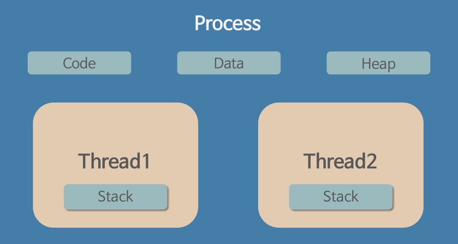

# 3. Operating System
**:book: Contents**
* [교착상태(데드락, Deadlock)의 개념과 조건](#교착상태의-개념과-조건)
* [사용자 수준 스레드와 커널 수준 스레드](#사용자-수준-스레드,-커널-수준-스레드)
* [외부 단편화와 내부 단편화](#외부-단편화와-내부-단편화)
* [Context Switching](#context-switching)
* [Swapping](#swapping)

### 교착상태의 개념과 조건
* 교착상태(데드락, Deadlock) 란
  * 첫 번째 스레드는 두 번째 스레드가 들고 있는 객체의 락이 풀리기를 기다리고 있고, 두 번째 스레드 역시 첫 번째 스레드가 들고 있는 객체의 락이 풀리기를 기다리는 상황을 일컷는다.
  * 모든 스레드가 락이 풀리기를 기다리고 있기 때문에, 무한 대기 상태에 빠지게 된다. 이런 스레드를 교착상태에 빠졌다고 한다.
* 교착상태의 4가지 조건
  1. 상호 배제(mutual exclusion)
      * 한 번에 한 프로세스만 공유 자원을 사용할 수 있다.
      * 좀 더 정확하게는, 공유 자원에 대한 접근 권한이 제한된다. 자원의 양이 제한되어 있더라도 교착상태는 발생할 수 있다.
  2. 들고 기다리기(hold and wait) = **점유대기**
      * 공유 자원에 대한 접근 권한을 갖고 있는 프로세스가, 그 접근 권한을 양보하지 않은 상태에서 다른 자원에 대한 접근 권한을 요구할 수 있다.
  3. 선취(preemption) 불가능 = **비선점**
      * 한 프로세스가 다른 프로세스의 자원 접근 권한을 강제로 취소할 수 없다.
  4. 대기 상태의 사이클(circular wait) = **순환대기**
      * 두 개 이상의 프로세스가 자원 접근을 기다리는데, 그 관계에 사이클이 존재한다.
* 교착상태 방지
  * 4가지 조건들 가운데 하나를 제거하면 된다.
  * 상호 배제(Mutual Exclusion)부정 : 한번에 여러개의 프로세스가 공유 자원을 사용할 수 있도록 한다.
  * 점유 및 대기(Hold and Wait) 부정 : 프로세스가 실행되기 전 필요한 모든 자원을 할당하여 프로세스 대기를 없애거나 자원이 점유되지 않은 상태에서만 자원을 요구하도록 한다.
  * 비선점(Non-preemption)부정 : 자원을 점유하고 있는 프로세스가 다른 자원을 요구할 때 점유하고 있는 자원을 반납하고, 요구한 자원을 사용하기 위해 기다리게 한다.
  * 환형 대기(Circular Wait)부정 : 자원을 선형 순서로 분류하여 고유 번호를 할당하고, 각 프로세스는 현재 점유한 자원의 고유 번호보다 앞이나 뒤 어느 한쪽 방향으로만 자원을 요구하도록 한다.

> :arrow_double_up:[Top](#3-operating-system)    :leftwards_arrow_with_hook:[Back](https://github.com/jihyuno301/tech-interview/blob/master/README.md)    :information_source:[Home](https://github.com/jihyuno301/tech-interview)
> - [코딩 인터뷰 완전 분석, 프로그래밍인사이트](https://www.kyobobook.co.kr/product/detailViewKor.laf?mallGb=KOR&ejkGb=KOR&barcode=9788966263080&OV_REFFER=http://click.linkprice.com/click.php?m=kbbook&a=A100532541&l=9999&l_cd1=0&u_id=jm0gctc7ca029ofs02yqe&l_cd2=0&tu=https%3A%2F%2Fwww.kyobobook.co.kr%2Fproduct%2FdetailViewKor.laf%3FmallGb%3DKOR%26ejkGb%3DKOR%26barcode%3D9788966263080)
> - [https://coding-factory.tistory.com/311](https://coding-factory.tistory.com/311)

### 사용자 수준 스레드와 커널 수준 스레드

* 쓰레드(Thread)
  * 쓰레드(Thread)란 간단히 말해 프로세스 내에서 실행되는 실행 단위이다. 
  * 프로세스는 이러한 쓰레드를 한 개 이상으로 나눌 수 있다. 
  * 쓰레드는 프로그램 카운터와 스택 포인터 등을 비롯한 쓰레드 실행 환경 정보(Context 정보), 지역 데이터, 스택을 독립적으로 가지면서 코드, 전역 데이터, 힙을 다른 쓰레드와 공유한다.

* 쓰레드의 구현
  * 쓰레드는 운영체제에 따라 다양하게 구현할 수 있는데, 대부분 다음 세 가지 형태로 구현한다. 
  * 사용자 수준 쓰레드는 쓰레드 라이브러리를 이용하여 작동하는 형태이고, 커널 수준 쓰레드는 커널(운영체제)에서 지원하는 형태이다. 그리고 이 둘을 혼합한 형태가 혼합형 쓰레드이다.
    * 사용자 수준 쓰레드 - 다대일 매핑
    * 커널 수준 쓰레드 - 일대일 매핑
    * 혼합형 쓰레드 - 다대다 매핑

* 사용자 수준 쓰레드
  * 사용자 수준 쓰레드는 사용자 영역의 쓰레드 라이브러리로 구현하고, 쓰레드와 관련된 모든 행위를 사용자 영역에서 하므로 커널이 쓰레드의 존재를 알지 못한다. 
  * 여기서 쓰레드 라이브러리는 쓰레드의 생성과 종료, 쓰레드 간의 메시지 전달, 쓰레드의 스케줄링과 컨텍스트 등 정보를 보관한다. 
  * 사용자 수준 쓰레드에서는 쓰레드 교환에 커널이 개입하지 않아 커널에서 사용자 영역으로 전환할 필요가 없다. 
  * 그리고 커널은 쓰레드가 아닌 프로세스를 한 단위로 인식하고 프로세서를 할당한다. 
  * 다수의 사용자 수준 쓰레드가 커널 수준 쓰레드 한 개에 매핑되므로 다대일 쓰레드 매핑이라고 한다. 
  
* 커널 수준 쓰레드
  * 커널 수준 쓰레드는 사용자 수준 쓰레드의 한계를 극복하는 방법으로, 커널이 쓰레드와 관련된 모든 작업을 관리한다. 
  * 한 프로세스에서 다수의 쓰레드가 프로세서를 할당받아 병행으로 수행하고, 쓰레드 한 개가 대기 상태가 되면 동일한 프로세스에 속한 다른 쓰레드로 교환이 가능하다. 
  * 이때도 커널이 개입하므로 사용자 영역에서 커널 영역으로 전환이 필요하다. 커널 수준 쓰레드는 사용자 수준 쓰레드와 커널 수준 쓰레드가 일대일로 매핑된다. 
  * 따라서 사용자 수준 쓰레드를 생성하면 이에 대응하는 커널 쓰레드를 자동으로 생성한다.
  
* 혼합형 쓰레드
  * 혼합형 쓰레드는 사용자 수준 쓰레드와 커널 수준 쓰레드를 혼합한 구조이다. 
  * 이는 시스템 호출을 할 때 다른 쓰레드를 중단하는 다대일 매핑의 사용자 수준 쓰레드와 쓰레드 수를 제한하는 일대일 매핑의 커널 수준 쓰레드 문제를 극복하는 방법이다. 
  * 즉, 사용자 수준 쓰레드는 커널 수준 쓰레드와 비슷한 경량 프로세스에 다대다로 매핑되고, 경량 프로세스는 커널 수준 쓰레드와 일대일로 매핑된다. 
  * 결국 다수의 사용자 수준 쓰레드에 다수의 커널 쓰레드가 다대다로 매핑된다. 

> :arrow_double_up:[Top](#3-operating-system)    :leftwards_arrow_with_hook:[Back](https://github.com/jihyuno301/tech-interview/blob/master/README.md)    :information_source:[Home](https://github.com/jihyuno301/tech-interview)
> - [https://coding-start.tistory.com/199](https://coding-start.tistory.com/199)

### 외부 단편화와 내부 단편화

> :arrow_double_up:[Top](#3-operating-system)    :leftwards_arrow_with_hook:[Back](https://github.com/jihyuno301/tech-interview/blob/master/README.md)    :information_source:[Home](https://github.com/jihyuno301/tech-interview)
> - 

### Context Switching

> :arrow_double_up:[Top](#3-operating-system)    :leftwards_arrow_with_hook:[Back](https://github.com/jihyuno301/tech-interview/blob/master/README.md)    :information_source:[Home](https://github.com/jihyuno301/tech-interview)

* Context Switching이란?
    * 현재 진행하고 있는 Task(Process, Thread)의 상태를 저장하고 다음 진행할 Task의 상태 값을 읽어 적용하는 과정을 말한다. 
* Context Switching 과정
    1. Task의 대부분 정보는 Register에 저장되고 PCB(Process Control Block)로 관리된다. 
    2. 현재 실행하고 있는 Task의 PCB 정보를 저장한다. (Process Stack, Ready Queue)
    3. 다음 실행할 Task의 PCB 정보를 읽어 Register에 적재하고 CPU가 이전에 진행했던 과정을 연속적으로 수행할 수 있다.
* Context Switching Cost (Process vs Thread)
    * Process Context Switching 비용 > Thread Context Switching 비용
    * Thread는 Stack 영역을 제외한 모든 메모리를 공유하므로 Context Switching 수행 시 Stack 영역만 변경하면 되기 때문에 비용이 적게 든다. 

> - [Context Switching이란?](https://nesoy.github.io/articles/2018-11/Context-Switching)

### Swapping
> :arrow_double_up:[Top](#3-operating-system)    :leftwards_arrow_with_hook:[Back](https://github.com/jihyuno301/tech-interview/blob/master/README.md)    :information_source:[Home](https://github.com/jihyuno301/tech-interview)
> - 

---

## Reference
> - 

## :house: [Home](https://github.com/WeareSoft/tech-interview)
